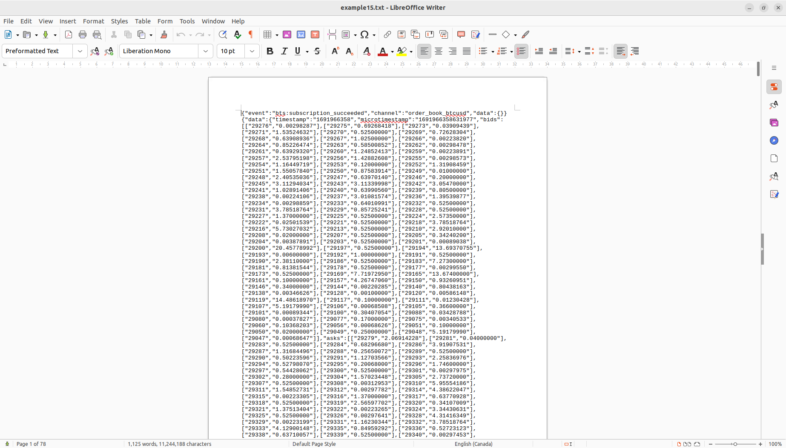
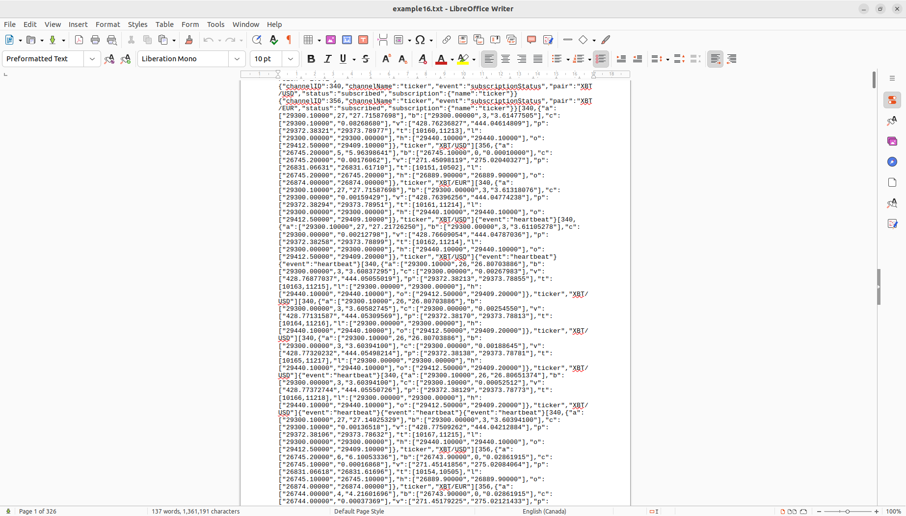

# websocket++
this code is used to connect to secure servers and retrieves data from it via API using *websocketpp* library and apply multithreading to retrieve data from various servers
in parallel and simultaneously


## prerequisites 

- [Asio](https://github.com/chriskohlhoff/asio)
- [beast](https://github.com/boostorg/beast)
- [websocketcpp](https://github.com/zaphoyd/websocketpp)


## download repo
```bash
git clone git@github.com:Mahmoud3ttya/websocket-.git
```


## requirments
- openssl version 1.1.1
  [openssl installation](https://itslinuxfoss.com/install-openssl-ubuntu-22-04/)
- cmake version 3.25
  [cmake installation](https://graspingtech.com/upgrade-cmake/)
   
- 

applay